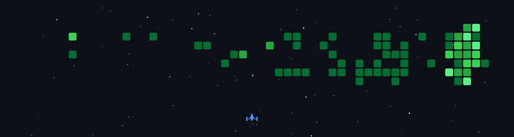

    <h1>Olá 👋</h1>

Meu nome é Davi Gomes Florencio e sou Técnico em informática na EEEP Capelão Frei Orlando e Graduado em Ciência da Computação na Universidade Federal do Ceará Campus Quixadá

Desenvolvedor Pleno com foco em Android e tecnologias móveis, especializado em Kotlin, Java e Flutter. Tenho experiência sólida no desenvolvimento de aplicações nativas para Android e wearables, utilizando Jetpack Compose, MVVM, Retrofit e Samsung Health SDK, além de implementar práticas de CI/CD, monitoramento e análise de dados para garantir alta qualidade e performance.

## 📊 Seja muito bem vindo(a) ao meu GitHub!

<table>
<tr>
<td>
<a href="https://next.ossinsight.io/widgets/official/compose-user-dashboard-stats?user_id=20430111" target="_blank" style="display: block" align="center">
  <picture>
    <source media="(prefers-color-scheme: dark)" srcset="https://next.ossinsight.io/widgets/official/compose-user-dashboard-stats/thumbnail.png?user_id=20430111&image_size=auto&color_scheme=dark" width="500" height="auto">
    
  </picture>
</a>

</td>
<td>

<a href="https://next.ossinsight.io/widgets/official/analyze-user-contribution-time-distribution?user_id=20430111&period=all_times" target="_blank" style="display: block" align="center">
  <picture>
    <source media="(prefers-color-scheme: dark)" srcset="https://next.ossinsight.io/widgets/official/analyze-user-contribution-time-distribution/thumbnail.png?user_id=20430111&period=all_times&image_size=auto&color_scheme=dark" width="500" height="auto">
    
  </picture>
</a>
</td>
</tr>
<tr>
<td>

</td>
</tr>

</table>

<!--  -->

## Stack Principal

<table>
<tr>
  <td>
 <h3> Mobile</h3>

  
  
  
  
  
   
  
  
   

  </td>
  <td>
  <h3> Back-end</h3>

  
  
  
  
  
   
  
  
  
  
  
  

  </td>
</tr>
</table>

## Tecnologias que tenho conhecimento

  
  
  
  
  
   
  
  
  
  
  
  
  
  
  
  
  
  
 

## Como chegar até mim?

<!--  -->

  
  
  </a>

